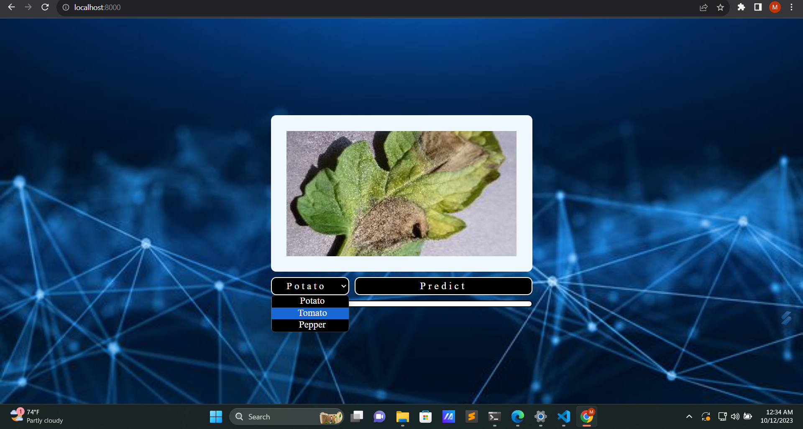
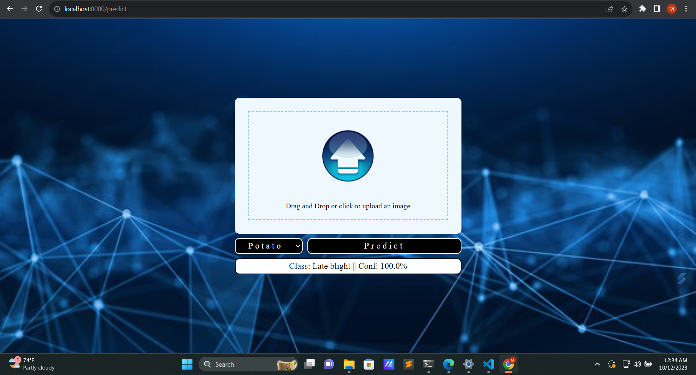

# Plant-Health-Analyzer
 Welcome to the Plant Health Analyzer repository! This web application utilizes machine learning to assess the health of plants by analyzing leaf images, aiding in the early detection of diseases and stress. The app focuses on potato, tomato, and pepper plants, providing valuable insights to farmers and gardeners.

## Features

- **Leaf Image Analysis**: Upload leaf images to receive an analysis of plant health and potential diseases.
- **Crop-Specific Analysis**: Tailored analysis for potato, tomato, and pepper plants.
- **User-Friendly Interface**: Enjoy an intuitive and easy-to-use web interface. It allows you to upload leaf images using the file input or by simply dragging and dropping them, providing a seamless user experience.
- **Deep Learning**: Advanced algorithms powered by deep learning for accurate diagnoses.
- **Promoting Plant Health**: Contributing to healthier crops and supporting sustainable agriculture.

## Tech Stack

- **Model Building:** Tensorflow, CNN, Data Augmentation
- **Backend:** fastapi
- **Frontend:** HTML, CSS, JavaScript

 ## Setup 
 1. First Download Zip or Clone the Project on Your Local Machine and cd to the directory where root file is located. or follow the below commands
    
    ```bash
    git clone https://github.com/manisha-v/plant-health-analyzer.git
    cd plant-health-analyzer
    ```

2. Download the data from [kaggle](https://www.kaggle.com/arjuntejaswi/plant-village).
   Extract and keep the data as follows:
   ```
   └──Plant-Health-Analyzer
       ├── potato-images/
       ├── tomato-images/
       ├── pepper-images/
       ├── Models/
       ├── main.py
       ├── static/
       ├── templates/
       ├── requirements.txt
       └── training.ipynb
   ```

4. Install Dependencies
   
   ```
   pip install -r requirements.txt
   ```

5. Run the Application

   ```
   python main.py
   ```
3. Open your web browser and go to [http://localhost:8000](http://localhost:8000) to access the Plant Health Analyzer.

## Website Preview

| Home Page | Uploaded Image and Dropdown | Prediction Page |
|-----------|---------------------------|-----------------|
|  |  |  |


## Scope of the project 

The "Plant Health Analyzer" project aims to revolutionize crop health monitoring for plants like potato, tomato, and pepper. Leveraging deep learning, it analyzes leaf images to detect diseases and stress. The project's future scope includes extending this analysis to various other plants by continually adding new models. The ultimate goal is to equip farmers and gardeners with a versatile tool for proactive plant health management, promoting sustainable agriculture and ensuring healthier, more productive crops.

## Need any help?
##### Connect me on [LinkedIn](https://www.linkedin.com/in/manisha-varshney-914646191/)   


 
